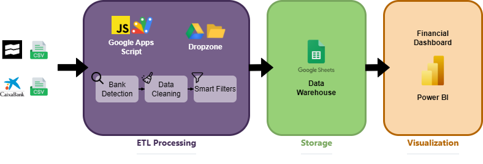
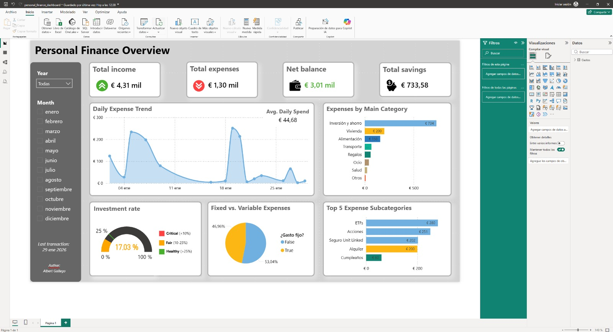

# 💸 MoneyFlow-Automata: Personal FinOps Pipeline

> **Sistema automatizado de ingeniería de datos para finanzas personales.** > Ingesta, limpieza y normalización de transacciones bancarias (Caixabank, Trade Republic & MyInvestor) sin dependencias de APIs de terceros.

## Resumen del Proyecto

Este repositorio contiene el código fuente (Google Apps Script) para transformar una hoja de cálculo de Google en un **Data Warehouse personal**. El sistema está diseñado bajo una arquitectura de "Dropzone" en Google Drive, permitiendo la carga asíncrona de extractos bancarios en formato CSV.

El objetivo es eliminar la entrada manual de datos y alimentar un Dashboard de **Power BI** con datos financieros limpios, categorizados y conciliados.



## Características "Smart"

### 1. Arquitectura Multi-Banco
El sistema detecta automáticamente el origen del archivo CSV basándose en sus cabeceras y aplica el parser correspondiente:
- **Trade Republic:** Procesa exportaciones (vía extensión) y gestiona decimales/fechas internacionales.
- **Caixabank:** Normaliza el formato europeo (`-2.800,00EUR`) a flotantes estándar y limpia descripciones.
- **MyInvestor:** Parsea el formato de exportación nativo (`Fecha de operación;Concepto;Importe;Divisa`), normaliza importes con coma decimal y mapea automáticamente fondos de inversión y promociones.

### 2. Lógica Contable de Doble Registro (Trade Republic)
Para mantener un balance neto real, el script detecta las recompensas (*Saveback*, *Round-up*) y divide la transacción en dos:
1.  **Ingreso:** "Dinero nuevo" generado por el reward.
2.  **Inversión:** Salida inmediata hacia el activo (ETF/Plan).

### 3. Filtros de "Ruido" y Pre-autorizaciones
Implementa algoritmos de limpieza para evitar falsos positivos en el análisis de gastos:
- **Anti-Duplicados:** Generación de un Hash ID único (Base64) basado en `Fecha + Concepto + Importe + Banco`. Evita duplicados incluso si se sube el mismo CSV tres veces.
- **Filtro de Pre-autorizaciones:** Detecta y elimina pares de transacciones en el mismo día que se anulan matemáticamente (ej. Parking cobrado y devuelto: `-6.50` y `+6.50`).
- **Filtro de Transferencias Propias:** Ignora movimientos de "Nómina" salientes o transferencias con el nombre del titular para evitar duplicar ingresos/gastos entre cuentas propias.


## 📊 Dashboard de Power BI

El dashboard integra los datos procesados desde Google Sheets para ofrecer visualizaciones en tiempo real de las finanzas personales:



**Archivo incluido:** [MoneyFlow_Dashboard.pbix](powerbi/MoneyFlow_Dashboard.pbix)

---

## Stack Tecnológico

- **ETL / Backend:** Google Apps Script (JavaScript).
- **Almacenamiento:** Google Sheets & Google Drive.
- **Visualización:** Power BI Desktop.
- **Fuentes de Datos:** CSVs planos (Exportación web).

## 📂 Estructura del Repositorio

```text
/src
├── config.gs           # (Ignorado por git) IDs de carpetas y claves.
├── file_processor.gs   # Orquestador: Lee Drive, detecta banco y parsea CSVs.
├── utils.gs            # Lógica de negocio: Generación de filas y reglas contables.
└── config.example.gs   # Plantilla de configuración.

/powerbi
├── MoneyFlow_Dashboard.pbix  # Dashboard interactivo de Power BI.
└── screens/
    └── overview.jpeg         # Captura del dashboard.
