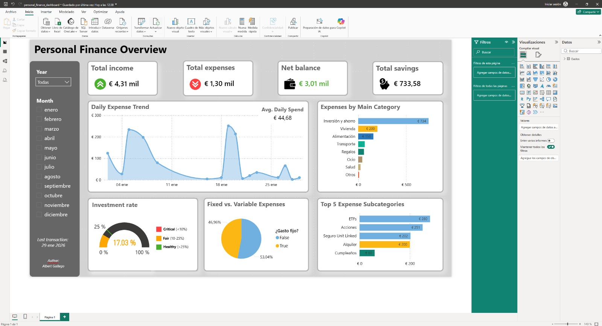

# 💸 MoneyFlow-Automata: Personal FinOps Pipeline
> **Sistema automatizado de ingeniería de datos para finanzas personales.**
> Ingesta, limpieza, normalización y categorización inteligente de transacciones bancarias (Caixabank, Trade Republic & MyInvestor).

## Resumen del Proyecto

Este repositorio contiene el código fuente (Google Apps Script) para transformar una hoja de cálculo de Google en un **Data Warehouse personal**. El sistema está diseñado bajo una arquitectura de "Dropzone" en Google Drive, permitiendo la carga asíncrona de extractos bancarios en formato CSV.

El objetivo es eliminar la entrada manual de datos y alimentar un Dashboard de **Power BI** con datos financieros limpios, categorizados y conciliados.


---

## Características "Smart"

### 1. Arquitectura Multi-Banco con Detección Robusta
El sistema detecta automáticamente el origen del archivo CSV comparando su primera línea contra un conjunto de **firmas canónicas** por banco (normalizadas: sin BOM, sin comillas, en minúsculas).

El mapa de firmas vive en `BANK_SIGNATURES` dentro de `file_processor.gs`: añadir soporte para un banco nuevo solo requiere añadir una entrada ahí y su función parser, sin tocar la lógica de detección.

Parsers implementados:
- **Trade Republic:** Header 2026 de 23 columnas. Detección de columnas por nombre, gestión de Bizums entrantes/salientes, Saveback y Round-up.
- **Caixabank:** Detección de columnas por nombre de header. Normaliza formato europeo (`-2.800,00EUR`) a flotantes estándar.
- **MyInvestor:** Detección de columnas por nombre de header. Parsea el formato nativo, normaliza importes con coma decimal y mapea fondos de inversión y promociones.

### 2. Lógica Contable de Doble Registro (Trade Republic)
Para mantener un balance neto real, el script detecta las recompensas (*Saveback*) y divide la transacción en dos asientos:
1. **Ingreso:** "Dinero nuevo" generado por el reward.
2. **Inversión:** Salida inmediata hacia el activo (ETF/Plan).

### 3. Filtros de "Ruido" y Pre-autorizaciones
Implementa algoritmos de limpieza para evitar falsos positivos en el análisis de gastos:
- **Anti-Duplicados:** Hash ID único (Base64) basado en `Fecha + Concepto + Importe + Banco`. Evita duplicados incluso si se sube el mismo CSV varias veces.
- **Filtro de Pre-autorizaciones:** Detecta y elimina pares de transacciones en el mismo día que se anulan matemáticamente (ej. cargo y devolución: `-6.50` y `+6.50`).
- **Filtro de Transferencias Propias:** Ignora movimientos de nómina salientes o transferencias con el nombre del titular para evitar duplicar ingresos/gastos entre cuentas propias.

### 4. Categorización Inteligente en Cascada
Cada transacción se categoriza siguiendo una cadena de prioridad de tres niveles:

```
1. Historial exacto   → Busca el mismo concepto bancario ya categorizado antes
2. Historial parcial  → Busca palabras significativas del concepto en el historial
                        (stop words filtradas; desempate por categoría más frecuente)
3. Keywords           → Diccionario hardcodeado como último recurso
4. Pendiente          → Si ningún nivel resuelve → pasa a Gemini
```

El historial se carga en memoria una sola vez por ejecución (`getHistoryCache`) para minimizar llamadas a la API de Sheets.

### 5. Categorización Asistida por IA (Gemini)
Las transacciones que ningún nivel del sistema resuelve se envían automáticamente a la **API de Gemini** (Google AI Studio — tier gratuito) al final de cada ejecución.

- Se procesan en lotes de 20 para respetar el rate limit del tier gratuito (15 RPM).
- El prompt incluye la taxonomía completa de categorías y subcategorías para que Gemini devuelva siempre valores válidos.
- Un validador (`validateAndFallback`) protege contra alucinaciones: si Gemini devuelve una categoría desconocida, cae a `Otros / N/A` en vez de escribir basura en la hoja.
- Las filas que Gemini tampoco resuelve se reportan en el email de resumen para revisión manual.

### 6. Reconciliación Automática de Bizums (`bizum_reconciler.gs`)
Resuelve automáticamente el problema de gastos compartidos pagados con Bizum:

**Flujo:**
1. Los Bizums entrantes de TR (`TRANSFER_INSTANT_INBOUND`) se insertan con un marcador interno `__BIZUM_PENDIENTE__`.
2. El reconciliador agrupa los Bizums por ventana temporal configurable (`BIZUM_TIME_SPAN_DAYS`).
3. Para cada grupo, busca un gasto susceptible cercano que cumpla:
   - Categoría/subcategoría susceptible de ser compartida (restaurante, bar, taxi, gasolina, delivery, concierto)
   - Dentro del time span (antes o después del grupo de Bizums)
   - La suma de Bizums representa entre el 20% y el 95% del gasto
4. **Si hay match:** descuenta la suma de Bizums del gasto, añade un apéndice en Descripción (`[compartido: -Xe con N personas]`) y elimina las filas de Bizum de la hoja.
5. **Si no hay match:** convierte el Bizum en un ingreso real (`Otros / Bizum`) para revisión manual.

Los Bizums salientes (`TRANSFER_INSTANT_OUTBOUND`) se marcan como `Pendiente Categorizar` para asignación manual de categoría.

### 7. Descripción Limpia Automática
El campo Descripción (col E) se genera a partir del concepto bancario bruto aplicando:
- Eliminación de códigos numéricos de 4+ dígitos
- Eliminación de sufijos geográficos y societarios (`BCN`, `SL`, `SA`, `ES`…)
- Capitalización correcta (primera letra de cada palabra)

El concepto original del banco se preserva intacto en la columna K.

Ejemplo: `"MERCADONA 0234 BARCELONA"` → `"Mercadona"`

### 8. Log Persistente + Notificación por Email
Al final de cada ejecución el sistema genera automáticamente:

**Archivo `.log` en Google Drive** — guardado en la carpeta raíz del libro de cálculo con nombre `moneyflow_YYYY-MM-DD_HH-MM.log`. Contiene el log completo con timestamps de todos los eventos, errores, resultados del reconciliador de Bizums y de Gemini.

**Email de resumen** — enviado a `CONFIG.NOTIFICATION_EMAIL` con:
- Archivos procesados y filas insertadas, desglosadas por banco
- Resultado de la reconciliación de Bizums
- Resultado de la categorización Gemini
- Lista de transacciones que siguen "Pendiente Categorizar" con número de fila y concepto original (workflow de resolución manual)
- Archivos ignorados por formato desconocido
- Errores críticos si los hubiera

---

## 📊 Dashboard de Power BI
El dashboard integra los datos procesados desde Google Sheets para ofrecer visualizaciones en tiempo real de las finanzas personales:



**Archivo incluido:** [MoneyFlow_Dashboard.pbix](powerbi/MoneyFlow_Dashboard.pbix)

---

## Stack Tecnológico
- **ETL / Backend:** Google Apps Script (JavaScript)
- **Categorización IA:** Google Gemini API (tier gratuito — Google AI Studio)
- **Almacenamiento:** Google Sheets & Google Drive
- **Visualización:** Power BI Desktop
- **Fuentes de Datos:** CSVs planos (exportación web)

---

## 📂 Estructura del Repositorio

```text
/src
├── config.gs               # (Ignorado por git) IDs de carpetas y claves.
├── config.example.gs       # Plantilla de configuración.
├── file_processor.gs       # Orquestador: detecta banco, parsea CSVs, coordina el pipeline.
├── utils.gs                # Lógica de negocio: categorización, generación de filas, helpers.
├── gemini_categorizer.gs   # Categorización IA de transacciones "Pendiente Categorizar".
├── bizum_reconciler.gs     # Reconciliación automática de gastos compartidos vía Bizum.
└── logger.gs               # Log persistente en Drive + notificación por email.

/powerbi
├── MoneyFlow_Dashboard.pbix  # Dashboard interactivo de Power BI.
└── screens/
    └── overview.jpeg         # Captura del dashboard.
```

---

## ⚙️ Configuración (`config.gs`)

```javascript
const CONFIG = {
  FOLDER_ID:            "ID_de_tu_carpeta_Finanzas_Dropzone",
  PROCESSED_FOLDER_ID:  "ID_de_tu_carpeta_de_archivos_procesados",
  SHEET_NAME:           "Gastos",
  GOOGLE_API_KEY:       "tu_clave_de_Google_AI_Studio",   // Gemini
  NOTIFICATION_EMAIL:   "tu_email@gmail.com",
  BIZUM_TIME_SPAN_DAYS: 3   // Ventana temporal para matching de Bizums (días)
};
```

---

## 🔄 Pipeline de Ejecución

```
processFolderCSVs()
│
├── initLogger()
├── Para cada CSV en Dropzone:
│   ├── detectBank()              → Firma de headers
│   ├── parseXXXCSV()             → Normalización por banco
│   └── processTransactionLogic() → Categorización en cascada + descripción limpia
│
├── reconcileBizums()             → Matching y ajuste de gastos compartidos
├── categorizePendingWithGemini() → IA para transacciones sin categoría
├── getStillPendingRows()         → Recoge pendientes para el email
└── finalizeLogger()              → Escribe .log en Drive + envía email
```
