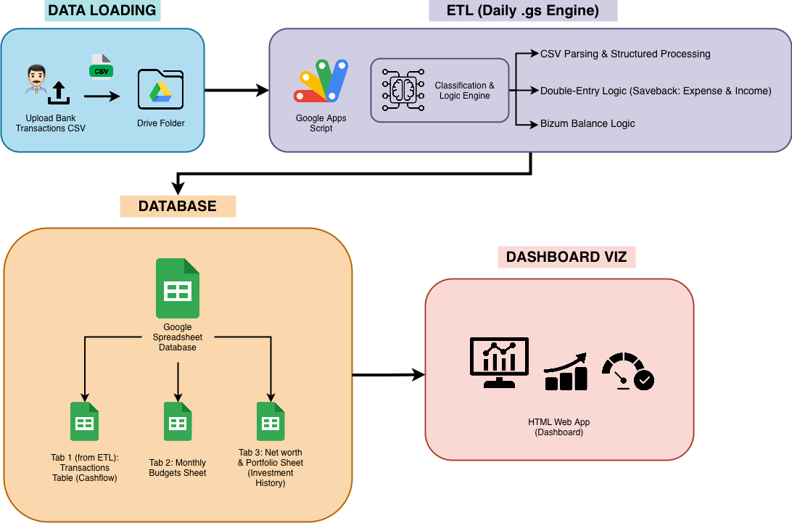

# 💸 MoneyFlow-Automata: Personal FinOps Pipeline
> **Sistema automatizado de ingeniería de datos para finanzas personales.**
> Ingesta, limpieza, normalización y categorización inteligente de transacciones bancarias (Caixabank, Trade Republic & MyInvestor), con dashboard web integrado.

## Resumen del Proyecto

Este repositorio contiene el código fuente (Google Apps Script) para transformar una hoja de cálculo de Google en un **Data Warehouse personal**. El sistema está diseñado bajo una arquitectura de "Dropzone" en Google Drive, permitiendo la carga asíncrona de extractos bancarios en formato CSV.

El objetivo es eliminar la entrada manual de datos y centralizar toda la información financiera en un **dashboard web propio**, servido directamente desde Google Apps Script sin dependencias externas.



---

## Características "Smart"

### 1. Arquitectura Multi-Banco con Detección Robusta
El sistema detecta automáticamente el origen del archivo CSV comparando su primera línea contra un conjunto de **firmas canónicas** por banco (normalizadas: sin BOM, sin comillas, en minúsculas).

El mapa de firmas vive en `BANK_SIGNATURES` dentro de `file_processor.gs`: añadir soporte para un banco nuevo solo requiere añadir una entrada ahí y su función parser, sin tocar la lógica de detección.

Parsers implementados:
- **Trade Republic:** Header 2026 de 23 columnas. Detección de columnas por nombre, gestión de Bizums entrantes/salientes, Saveback y Round-up.
- **Caixabank:** Detección de columnas por nombre de header. Normaliza formato europeo (`-2.800,00EUR`) a flotantes estándar.
- **MyInvestor:** Detección de columnas por nombre de header. Parsea el formato nativo, normaliza importes con coma decimal y mapea fondos de inversión y promociones.

### 2. Lógica Contable de Doble Registro (Trade Republic)
Para mantener un balance neto real, el script detecta las recompensas (*Saveback*) y divide la transacción en dos asientos:
1. **Ingreso:** "Dinero nuevo" generado por el reward.
2. **Inversión:** Salida inmediata hacia el activo (ETF/Plan).

### 3. Filtros de "Ruido" y Pre-autorizaciones
Implementa algoritmos de limpieza para evitar falsos positivos en el análisis de gastos:
- **Anti-Duplicados:** Hash ID único (Base64) basado en `Fecha + Concepto + Importe + Banco`. Evita duplicados incluso si se sube el mismo CSV varias veces.
- **Filtro de Pre-autorizaciones:** Detecta y elimina pares de transacciones en el mismo día que se anulan matemáticamente (ej. cargo y devolución: `-6.50` y `+6.50`).
- **Filtro de Transferencias Propias:** Ignora movimientos de nómina salientes o transferencias con el nombre del titular para evitar duplicar ingresos/gastos entre cuentas propias.

### 4. Categorización Inteligente en Cascada
Cada transacción se categoriza siguiendo una cadena de prioridad de tres niveles:

```
1. Historial exacto   → Busca el mismo concepto bancario ya categorizado antes
2. Historial parcial  → Busca palabras significativas del concepto en el historial
                        (stop words filtradas; desempate por categoría más frecuente)
3. Keywords           → Diccionario hardcodeado como último recurso
4. Pendiente          → Se notifica por email para categorización manual
```

El historial se carga en memoria una sola vez por ejecución (`getHistoryCache`) para minimizar llamadas a la API de Sheets. Con el tiempo, a medida que el historial crece, cada vez menos transacciones llegan al nivel 4.

### 5. Reconciliación Automática de Bizums (`bizum_reconciler.gs`)
Resuelve automáticamente el problema de gastos compartidos pagados con Bizum:

**Flujo:**
1. Los Bizums entrantes de TR (`TRANSFER_INSTANT_INBOUND`) se insertan con un marcador interno `__BIZUM_PENDIENTE__`.
2. El reconciliador agrupa los Bizums por ventana temporal configurable (`BIZUM_TIME_SPAN_DAYS`).
3. Para cada grupo, busca un gasto susceptible cercano que cumpla:
   - Categoría/subcategoría susceptible de ser compartida (restaurante, bar, taxi, gasolina, delivery, concierto)
   - Dentro del time span (antes o después del grupo de Bizums)
   - La suma de Bizums representa entre el 20% y el 95% del gasto
4. **Si hay match:** descuenta la suma de Bizums del gasto, añade un apéndice en Descripción (`[compartido: -Xe con N personas]`) y elimina las filas de Bizum de la hoja.
5. **Si no hay match:** convierte el Bizum en un ingreso real (`Otros / Bizum`) para revisión manual.

Los Bizums salientes (`TRANSFER_INSTANT_OUTBOUND`) se marcan como `Pendiente Categorizar` para asignación manual de categoría.

### 6. Descripción Limpia Automática
El campo Descripción (col E) se genera a partir del concepto bancario bruto aplicando:
- Eliminación de códigos numéricos de 4+ dígitos
- Eliminación de sufijos geográficos y societarios (`BCN`, `SL`, `SA`, `ES`…)
- Capitalización correcta (primera letra de cada palabra)

El concepto original del banco se preserva intacto en la columna K.

Ejemplo: `"MERCADONA 0234 BARCELONA"` → `"Mercadona"`

### 7. Log Persistente + Notificación por Email
Al final de cada ejecución el sistema genera automáticamente:

**Archivo `.log` en Google Drive** — guardado en la carpeta raíz del libro de cálculo con nombre `moneyflow_YYYY-MM-DD_HH-MM.log`. Contiene el log completo con timestamps de todos los eventos, errores, resultados del reconciliador de Bizums y de Gemini.

**Email de resumen** — enviado a `CONFIG.NOTIFICATION_EMAIL` **únicamente cuando hay novedades** (nuevas filas, errores o transacciones pendientes). Si no hay CSVs nuevos, no se envía ningún email.

Contenido del email:
- Archivos procesados y filas insertadas, desglosadas por banco
- Resultado de la reconciliación de Bizums
- Lista de transacciones "Pendiente Categorizar" con número de fila y concepto original para categorización manual rápida — con enlace directo a la hoja
- Archivos ignorados por formato desconocido
- Errores críticos si los hubiera

---

## 📊 Dashboard Web
El dashboard está construido en HTML/JS puro con **Apache ECharts** y se sirve directamente desde Google Apps Script como Web App, sin necesidad de servidores externos ni despliegues.

**Tres vistas principales:**
- **Resumen** — KPIs del mes actual, evolución 12 meses, distribución de gastos y últimas transacciones
- **Análisis mensual** — desglose por categoría con barras de progreso, top 5 gastos, comparativa mes actual vs anterior vs media 6 meses, y split consumo/inversión
- **Histórico** — evolución anual por categoría, inversión acumulada, tasa de ahorro mensual y comparativa año a año
- **Patrimonio e Inversión** — snapshot actual de cartera por broker/clase de activo, evolución histórica de rentabilidad por activo

---

## Stack Tecnológico
- **ETL / Backend:** Google Apps Script (JavaScript)
- **Almacenamiento:** Google Sheets & Google Drive
- **Visualización:** HTML + Apache ECharts (servido como Google Apps Script Web App)
- **Fuentes de Datos:** CSVs planos (exportación web)

---

## 📂 Estructura del Repositorio

```text
/src
├── config.gs               # (Ignorado por git) IDs de carpetas, claves y parámetros.
├── config.example.gs       # Plantilla de configuración.
├── file_processor.gs       # Orquestador: detecta banco, parsea CSVs, coordina el pipeline.
├── utils.gs                # Lógica de negocio: categorización, generación de filas, helpers.
├── bizum_reconciler.gs     # Reconciliación automática de gastos compartidos vía Bizum.
├── dashboard_exporter.gs   # Exporta Gastos e Historico_Portfolio a JSON para el dashboard.
├── logger.gs               # Log persistente en Drive + notificación por email condicional.
└── index.html              # Dashboard web (servido como Apps Script Web App).
```

---

## ⚙️ Configuración (`config.gs`)

```javascript
const CONFIG = {
  FOLDER_ID:            "ID_de_tu_carpeta_Finanzas_Dropzone",
  PROCESSED_FOLDER_ID:  "ID_de_tu_carpeta_de_archivos_procesados",
  SHEET_NAME:           "Gastos",
  SPREADSHEET_ID:       "ID_del_libro_de_calculo",        // Para getDashboardData()
  NOTIFICATION_EMAIL:   "tu_email@gmail.com",
  BIZUM_TIME_SPAN_DAYS: 3   // Ventana temporal para matching de Bizums (días)
};
```

---

## 🔄 Pipeline de Ejecución

```
processFolderCSVs()
│
├── initLogger()
├── Para cada CSV en Dropzone:
│   ├── detectBank()              → Firma de headers (detección robusta multi-banco)
│   ├── parseXXXCSV()             → Normalización por banco + detección de delimitador
│   └── processTransactionLogic() → Categorización en cascada + descripción limpia
│
├── reconcileBizums()             → Matching y ajuste de gastos compartidos
├── logPendingRows()              → Recoge pendientes para el email
└── finalizeLogger()              → Escribe .log en Drive + envía email (solo si hay novedades)

getDashboardData()  ← llamada desde el dashboard web (Apps Script Web App)
│
├── Lee hoja "Gastos"              → transacciones históricas
└── Lee hoja "Historico_Portfolio" → snapshots de cartera
```
